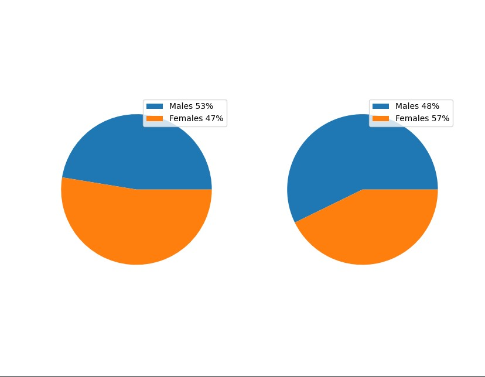
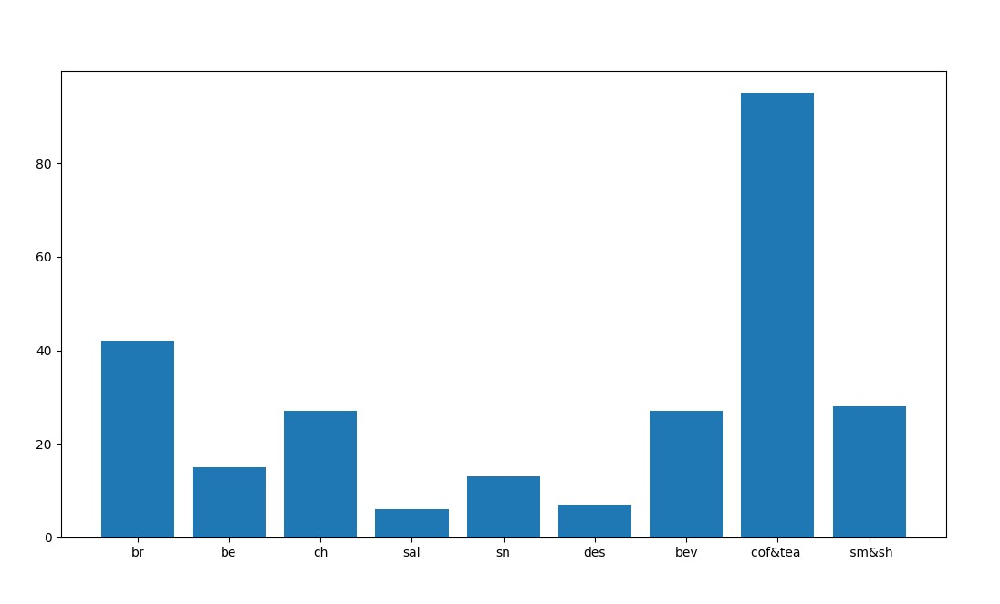

# Анализ данных при помощи Pandas и их визуализация.

Я делал этот проект для ознакомления меня с Pandas и matlotlib.


## Pandas и matplotlib документации.

[Pandas](https://pandas.pydata.org/docs/)

[matplotlib](https://matplotlib.org/stable/users/index.html)


## Установка всех нужных библеотек.

На Windows 7/8/10/11.

```bash
pip install pandas
```

```bash
pip install matplotlib
```
На Linux Ubuntu.

```bash
sudo apt-get install python3-matplotlib
```
## Файл first.py

В этом файле я ознакамливался с данной библеотекой и поэтому тут не нужно тспользовать matplotlib.

## Файл second.py

В этом файле я уже начинаю испоьзовать matplotlib для визуализации, я использовал диаграмму в виде пирога.

## Файл third.py

В этом файле я использую столбчатую диаграмму для визуализации.


Нужно импортировать нужные модули


```bash
import pandas as pd
import matplotlib.pyplot as plt
```

Потом нужно сделать переменные которые будут читать CSV файлы.

```bash
df = pd.read_csv('StudentsPerformance.csv')
df1 = pd.read_csv('countries of the world.csv')
```
    
## Screenshots





